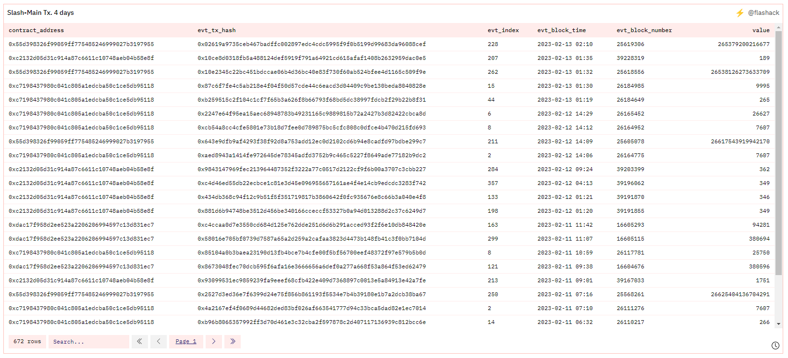

# Dune

## Slash.fi の手数料収集アドレスへのトランザクション分析


Mainnet - Polygon, Ethereum, BSC, Avalanche


<figure><figcaption></figcaption></figure>

### Slash.fi 対応 Mainnet 中、データ取得可能なものについて分析

現状、トランザクション数は少なく、Polygon 等 Fee が安く安定した一部 Chain の利用が中心である（ Gass Fee の高騰等による消極的選択ともいえる ）

_同様の理由で、今後 Arbitrum 等への展開が期待される。_\
_（ Dune では、Arbitrum, Optimism のデータは既に取得可である。ニーズがある ）_


Goerli testnet


<figure><figcaption></figcaption></figure>


Mainnet Tx.


<figure><figcaption></figcaption></figure>

### Phalcon でのトランザクション詳細分析へ&#x20;
